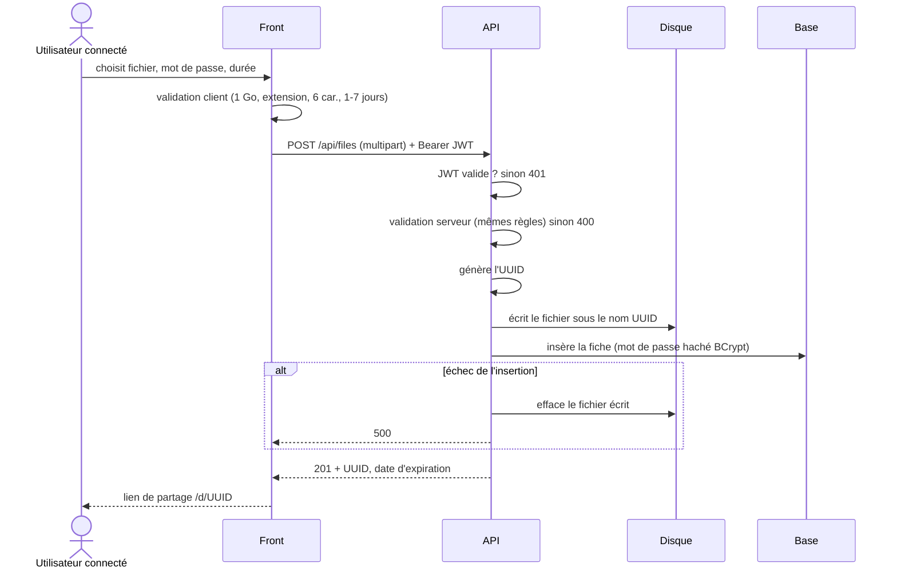
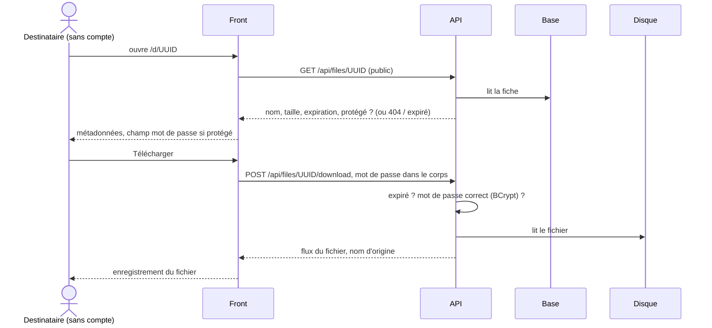

# Architecture technique

Comment les briques s'emboîtent et comment les données circulent. Le choix de
chaque technologie est justifié dans [`choix-techno.md`](choix-techno.md).

## Vue d'ensemble


| Brique | Rôle | Technologie | Où elle tourne |
|---|---|---|---|
| Front | écrans, validation client, stockage du JWT | Angular | `ng serve`, port 4200 |
| API | règles métier, validation serveur, sécurité | Spring Boot | poste, port 8080 |
| Base de données | comptes et fiches des fichiers | PostgreSQL + Flyway | conteneur lancé par Spring, données sur un volume |
| Stockage des fichiers | contenu des fichiers, nommés par leur UUID | disque local | dossier configurable du poste |
| Authentification | prouver l'identité à chaque requête | JWT signé (HS256), BCrypt | émis et vérifié par l'API |

**Le contenu d'un fichier ne passe jamais par la base** : PostgreSQL garde la fiche
(nom, taille, dates, empreinte du mot de passe), le disque garde les octets.

## En développement : proxy plutôt que CORS

Le front (`localhost:4200`) et l'API (`localhost:8080`) n'ont pas le même port, donc
pas la même **origine** pour le navigateur. Par sécurité, il bloque les appels d'une
origine vers une autre, sauf si le serveur les autorise explicitement (en-têtes
**CORS**).

Le serveur de dev Angular sert de **proxy** (`proxy.conf.json`) : le navigateur
appelle `localhost:4200/api/…`, et Angular relaie la requête à `localhost:8080`. Le
navigateur ne voit qu'une seule origine : il n'y a pas de CORS à gérer.

Pourquoi pas une configuration CORS dans Spring :
- elle n'existerait **que pour le dev**. En production, front et API sont servis
  derrière un même reverse proxy, sous le même domaine : le proxy de dev reproduit
  déjà ce schéma ;
- autoriser une origine, c'est ouvrir une porte dans la sécurité de l'API, et
  c'est une règle de plus à maintenir et à justifier dans `SECURITY.md`.

## Découpage interne

### Back — par couche, comme au P2

```
controller/    AuthController, FileController          HTTP ↔ DTO, codes de retour
service/       AuthService, FileService, JwtService,   règles métier, validation serveur
               FilePurgeService
repository/    AccountRepository, SharedFileRepository Spring Data JPA
model/         Account, SharedFile                     entités JPA (jamais exposées)
dto/           requêtes et réponses de l'API
storage/       FileStorage (interface), LocalFileStorage
configuration/ SpringSecurityConfig, CustomUserDetailService
exception/     RestExceptionHandler, ErrorDetails      format d'erreur unique
```

Un controller ne parle qu'à un service. Un service parle aux repositories et à
`FileStorage`, sans savoir où les octets sont rangés.

### Front — par écran

```
core/       auth.service, auth.interceptor (ajoute le JWT), auth.guard   briques du P2
features/   auth/ (connexion, inscription) · upload/ · download/ · my-files/
shared/     composants du design system : header, callout, bouton…
```

## Flux principaux

Les routes ci-dessous sont celles du [contrat d'interface](contrat-interface.md).

### Téléversement (US01)



Le fichier est écrit **en flux** sur le disque, jamais chargé en entier en mémoire.
Spring refuse par défaut tout envoi de plus de 1 Mo : ce plafond est porté à
**1 Go**, la taille maximale autorisée par les spécifications.

### Téléchargement (US02)



Mot de passe en `POST`, **jamais dans l'URL** : une URL finit dans les logs du
serveur et l'historique du navigateur.

### Expiration et purge (US01, US10 partielle)

Le statut n'est **jamais stocké** : il se calcule à chaque accès en comparant
`expires_at` à l'heure courante.

| Quand | Qui | Effet |
|---|---|---|
| à chaque téléchargement | `FileService` | refus si `expires_at` est dépassée |
| à chaque affichage de l'historique | `FileService` | statut actif · expire bientôt · expiré |
| chaque nuit | `FilePurgeService` (`@Scheduled`) | efface du disque les fichiers expirés, **garde la fiche** |

La purge efface « si le fichier existe encore » : la relancer ne casse rien.

## Cohérence entre disque et base

Une transaction PostgreSQL est **atomique** (le A d'ACID) : tout ou rien, mais
seulement **dans la base**. Le système de fichiers n'est pas transactionnel et
n'entre pas dans cette transaction : une opération peut réussir sur le disque et
échouer en base, ou l'inverse. On compense donc à la main. La règle : **mieux vaut un fichier orphelin sur le
disque qu'une fiche qui pointe vers un fichier absent**.

| Opération | Ordre | Si la 2ᵉ étape échoue |
|---|---|---|
| Envoi (US01) | disque, puis base | le fichier écrit est effacé |
| Suppression (US06) | base, puis disque | fichier orphelin, journalisé |
