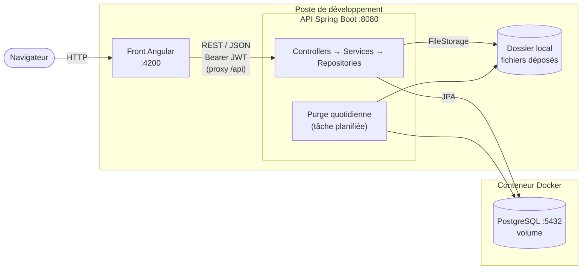
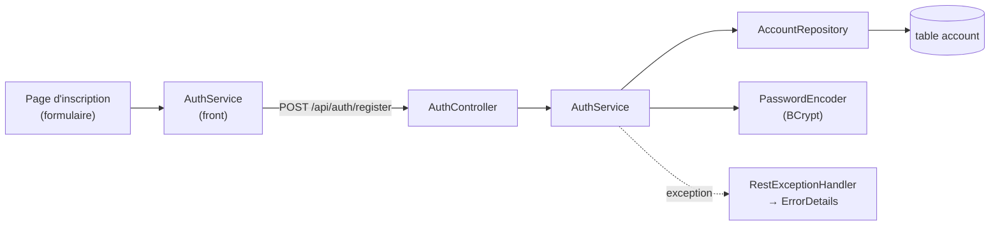
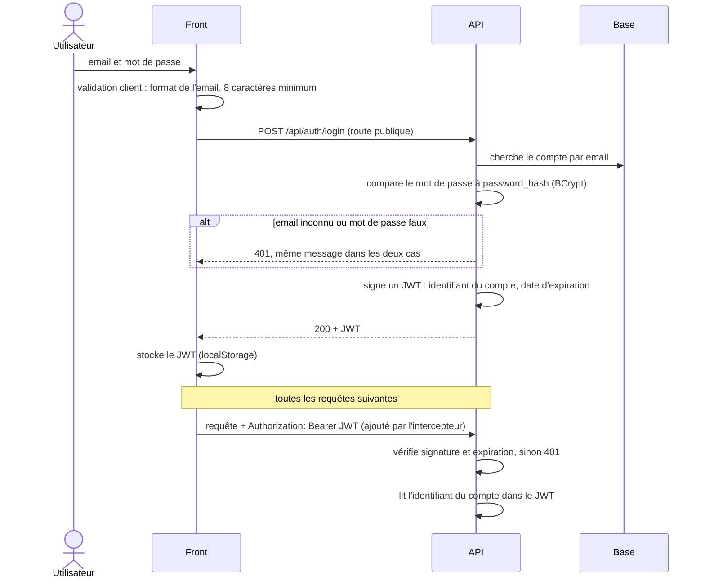
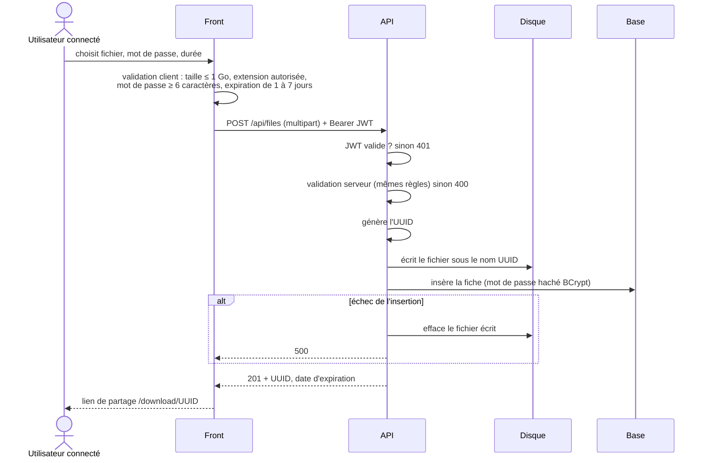
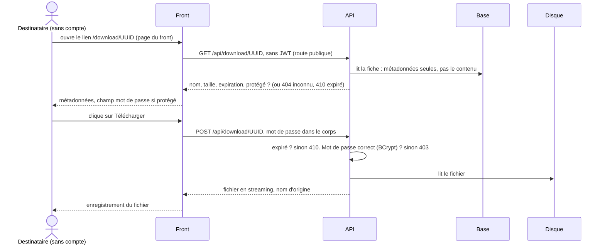
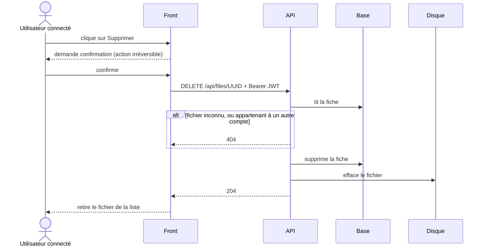

# Architecture technique

Comment les briques s'emboîtent et comment les données circulent. Le choix de
chaque technologie est justifié dans [`choix-techno.md`](choix-techno.md).

## Vue d'ensemble



| Brique | Rôle | Technologie | Où elle tourne |
|---|---|---|---|
| Front | écrans, validation client, stockage du JWT | Angular | `ng serve`, port 4200 |
| API | règles métier, validation serveur, sécurité | Spring Boot | poste, port 8080 |
| Base de données | comptes et fiches des fichiers | PostgreSQL + Flyway | conteneur lancé par Spring, données sur un volume Docker |
| Stockage des fichiers | contenu des fichiers, nommés par leur UUID | disque local | dossier configurable du poste |
| Authentification | prouver l'identité à chaque requête | JWT signé (HS256), BCrypt | émis et vérifié par l'API |

**Le contenu d'un fichier ne passe jamais par la base** : PostgreSQL garde la fiche
(nom, taille, dates, empreinte du mot de passe), le disque garde les octets.

## En développement : proxy plutôt que CORS

Le front (`localhost:4200`) et l'API (`localhost:8080`) n'ont pas le même port, donc
pas la même **origine** pour le navigateur. Par sécurité, il bloque les appels d'une
origine vers une autre, sauf si le serveur les autorise explicitement (en-têtes
**CORS**).

Le serveur de dev Angular sert de **proxy** (`proxy.conf.json`) : le navigateur
appelle `localhost:4200/api/…`, et Angular relaie la requête à `localhost:8080`. Le
navigateur ne voit qu'une seule origine : il n'y a pas de CORS à gérer.

Pourquoi pas une configuration CORS dans Spring :
- elle n'existerait **que pour le dev**. En production, front et API sont servis
  derrière un même reverse proxy, sous le même domaine : le proxy de dev reproduit
  déjà ce schéma ;
- CORS ne protège pas l'API, il protège l'utilisateur : le navigateur empêche un
  autre site de lire les réponses de l'API. Configurer CORS, c'est **assouplir**
  cette protection, et une règle trop large la lève pour tout le monde.

## Sécurité : rôle de chaque couche

| Couche | Garantit | Où |
|---|---|---|
| Infrastructure (reverse proxy, en production) | HTTPS · une origine unique, qui rend CORS superflu | hors périmètre du prototype |
| Application (Spring) | authentification JWT · mots de passe hachés (BCrypt) · droits sur les fichiers · validation | ce dépôt, en dev comme en prod |

Les deux se complètent : le proxy ne remplace aucun contrôle de l'application, qui
reste seule à protéger l'API contre un appel direct (`curl`, Postman).

### Configuration de Spring Security

`SpringSecurityConfig` remplace le comportement par défaut de Spring Security, qui
verrouille toutes les routes derrière un formulaire de connexion.

| Réglage | Raison |
|---|---|
| `PasswordEncoder` = BCrypt | Le service ne connaît que l'interface : changer d'algorithme ne touche que la configuration. BCrypt **sale** chaque hash (sel aléatoire stocké dans le hash, `$2a$10$<sel><empreinte>`) : deux mots de passe identiques donnent deux hash différents. |
| CSRF désactivé | Une attaque CSRF exploite les cookies que le navigateur envoie seul. Le JWT voyage dans un en-tête ajouté par le code du front : rien d'automatique à exploiter. |
| `STATELESS` | Aucune session côté serveur ; chaque requête apporte sa preuve (le JWT). |
| `/api/auth/**`, `/api/download/**` publics, le reste authentifié | Une règle par niveau d'accès (décision du 2026-10-03). |

**En-têtes ajoutés par défaut** à chaque réponse, conservés tels quels :

| En-tête | Protège contre |
|---|---|
| `X-Content-Type-Options: nosniff` | le navigateur qui « devine » le type d'un contenu : un fichier déposé servi comme texte ne peut pas être exécuté comme HTML ou JavaScript. Utile pour le téléchargement (US02). |
| `X-Frame-Options: DENY` | l'affichage de l'appli dans une `iframe` d'un autre site (*clickjacking* : faire cliquer l'utilisateur à son insu) |
| `Cache-Control: no-cache, no-store…` | la conservation de réponses sensibles dans le cache du navigateur ou d'un proxy |
| `Strict-Transport-Security` | le retour en HTTP non chiffré ; envoyé seulement en HTTPS, donc absent en dev |

## Validation en trois niveaux

Chaque règle (spécifications, [contrat d'interface](contrat-interface.md)) est
contrôlée à plusieurs niveaux, chacun pour une raison différente.

| Niveau | Rôle | Exemples |
|---|---|---|
| Front (formulaire) | **confort** : erreur immédiate, sans appel réseau | format de l'email, 8 caractères minimum, mots de passe identiques · taille ≤ 1 Go, extension autorisée |
| Back (`@Valid` sur le DTO, services) | **sécurité** : seule barrière fiable, l'API pouvant être appelée sans le front | mêmes règles, sauf la confirmation du mot de passe (propre au formulaire) |
| Base (contraintes SQL) | **garantie finale**, même en cas d'accès concurrent ou d'erreur de code | email unique · champs obligatoires · `expires_at > uploaded_at` |

Le niveau front est contournable (`curl`) ; le niveau base ne donne qu'une erreur
technique. C'est le back qui transforme chaque refus en réponse claire (`400`, `409`).

**Exemple : l'email du compte (US03, US04)**

| Où | Traitement | Pourquoi là |
|---|---|---|
| Front | retire les espaces, vérifie le format | confort : un email collé avec un espace en trop n'est pas bloqué |
| Back, DTO | vérifie le format (`@Email` : `400` si espaces ou format faux) | sécurité : l'API peut être appelée sans le front |
| Back, service | met en minuscules (`normalizeEmail`) | la forme de référence est fixée à un seul endroit, le serveur, pour tous les clients |
| Base | unicité (`uk_account_email`) | garantie finale |

## Découpage interne

### Back — par couche

| Package | Contient | Rôle |
|---|---|---|
| `controller/` | `AuthController`, `FileController` | reçoit la requête HTTP, appelle le service, renvoie la réponse et son code (201 créé, 404 introuvable…) |
| `service/` | `AuthService`, `FileService`, `JwtService`, `FilePurgeService` | règles métier et validation serveur |
| `repository/` | `AccountRepository`, `SharedFileRepository` | lecture et écriture en base (Spring Data JPA) |
| `model/` | `Account`, `SharedFile` | entités JPA, le reflet des tables ; jamais renvoyées au client |
| `dto/` | objets d'entrée et de sortie, suffixés `DTO` (`RegisterRequestDTO`) | la forme exacte des données échangées avec le front |
| `mapper/` | interfaces MapStruct | convertit une entité en DTO. Ajoute des champs **calculés**, absents des tables : le statut, déduit de `expires_at` comparée à l'heure actuelle ; « protégé » (oui / non), qui fait afficher le cadenas et le champ mot de passe, déduit de `password_hash` sans jamais envoyer ce hash au front |
| `storage/` | `FileStorage`, `LocalFileStorage` | écrit, lit et efface un fichier sur le disque, sans rien décider : ce sont les services qui choisissent quoi effacer (`FileService` pour la suppression US06, `FilePurgeService` pour la purge) |
| `configuration/` | `SpringSecurityConfig`, `CustomUserDetailService` | routes publiques ou protégées, vérification du JWT |
| `exception/` | `RestExceptionHandler`, `ErrorDetails` | transforme toute erreur en une réponse au même format |

Un controller ne parle qu'à un service. Un service parle aux repositories et à
`FileStorage`, sans savoir où les octets sont rangés.

#### Parcours d'une requête : l'inscription (US03)



| Couche | Sait | Ignore |
|---|---|---|
| `AuthController` | HTTP : route, corps JSON, code `201` | les règles métier, la base |
| `AuthService` | les règles : email libre, mot de passe haché | HTTP, le SQL |
| `AccountRepository` | lire et écrire la table `account` | pourquoi on lui demande |
| `RestExceptionHandler` | traduire une exception en code et en `ErrorDetails` | où elle a été levée |

Les autres routes suivent le même chemin.

#### Ordre de construction d'une route

Chaque route est construite de bas en haut. Chaque pièce ne s'appuie que sur des pièces
déjà écrites : tout compile et se vérifie à chaque étape.

| # | Pièce | Traduit | Vérification |
|---|---|---|---|
| 1 | DTO | le contrat (`openapi.yaml`) | compilation |
| 2 | entité + repository | le schéma (`V1__init.sql`) | démarrage : Hibernate compare l'entité à la table |
| 3 | service | les règles métier, du DTO vers l'entité | tests unitaires |
| 4 | `RestExceptionHandler` | les exceptions du service en codes HTTP | via la pièce 5 |
| 5 | controller | le service, branché sur HTTP | test d'intégration, `curl` |

Les pièces 1 et 2 transcrivent des décisions prises à la conception ; le service les
relie. Le controller vient en dernier : il ne fait que brancher l'ensemble. Le front
suit, une fois la route vérifiée.

### Front — par écran

```
core/       auth.service, auth.interceptor (ajoute le JWT), auth.guard
features/   auth/ (connexion, inscription) · upload/ · download/ · my-files/
shared/     composants du design system : header, callout, bouton…
```

## Flux principaux

Les routes ci-dessous sont celles du [contrat d'interface](contrat-interface.md).

### Connexion (US03, US04)



L'identité vient **toujours du JWT**, jamais d'un paramètre : l'historique (US05)
et la suppression (US06) savent ainsi à qui ils répondent, sans qu'on puisse se faire
passer pour un autre compte. Un message identique pour « email inconnu » et « mot de
passe faux » évite de révéler quels emails sont inscrits.

L'inscription (US03) suit le même chemin sans émettre de JWT : email unique vérifié,
mot de passe haché, réponse 201 ; l'utilisateur se connecte ensuite.

### Téléversement (US01)



Le fichier est écrit **en streaming** sur le disque, jamais chargé en entier en mémoire.
Spring refuse par défaut tout envoi de plus de 1 Mo : ce plafond est porté à
**1 Go**, la taille maximale autorisée par les spécifications.

### Téléchargement (US02)

Le destinataire **n'a pas de compte** : posséder le lien suffit (spec US02). C'est
l'expéditeur qui le lui transmet, par ses propres moyens (mail, messagerie), après
l'avoir copié sur l'écran « lien généré » ; l'application n'envoie aucun email.



Mot de passe en `POST`, **jamais dans l'URL** : une URL finit dans les logs du
serveur et l'historique du navigateur.

### Suppression (US06)



Le fichier d'un autre compte reçoit la même réponse qu'un fichier inexistant : l'API
ne confirme pas son existence.

### Expiration et purge (US01, US10 partielle)

Le statut n'est **jamais stocké** : il se calcule à chaque accès en comparant
`expires_at` à l'heure courante.

| Quand | Qui | Effet |
|---|---|---|
| à chaque téléchargement | `FileService` | refus si `expires_at` est dépassée |
| à chaque affichage de l'historique | `FileService` | statut actif · expire bientôt · expiré |
| chaque nuit | `FilePurgeService` (`@Scheduled`) | efface du disque les fichiers expirés, **garde la fiche** |

La purge efface « si le fichier existe encore » : la relancer ne casse rien.

## Cohérence entre disque et base

Une transaction PostgreSQL est **atomique** (le A d'ACID) : tout ou rien, mais
seulement **dans la base**. Le système de fichiers n'est pas transactionnel et
n'entre pas dans cette transaction : une opération peut réussir sur le disque et
échouer en base, ou l'inverse. On compense donc à la main. La règle : **mieux vaut un fichier orphelin sur le
disque qu'une fiche qui pointe vers un fichier absent**.

| Opération | Ordre | Si la 2ᵉ étape échoue |
|---|---|---|
| Envoi (US01) | disque, puis base | le fichier écrit est effacé |
| Suppression (US06) | base, puis disque | fichier orphelin, journalisé |
