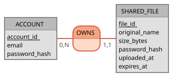
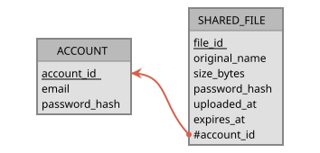

# Modèle de données

MCD Merise, source Mocodo : [`modele-donnees/datashare.mcd`](modele-donnees/datashare.mcd).
Déduit des US01 à US06 (+ US10 partielle) et des maquettes.



## En une phrase

Deux tables : **`account`**, les personnes inscrites, et **`shared_file`**, les
fichiers qu'elles ont déposés. Le contenu des fichiers n'est **pas** en base : il
est sur le disque du serveur. La base ne garde que leur fiche descriptive.

**Lecture du schéma** — en Merise, la cardinalité s'écrit à côté de l'entité
qu'elle décrit (à l'inverse d'UML) :

| Côté | Signifie | Pourquoi |
|---|---|---|
| `ACCOUNT` **0,N** | un compte possède 0 à N fichiers | un compte tout juste créé n'a encore rien déposé |
| `SHARED_FILE` **1,1** | un fichier a exactement 1 propriétaire | pas d'upload anonyme (US07 écartée) ; sinon ce serait 0,1 |

Côté tables, cela donne une colonne `account_id` **non nulle** dans `shared_file` :
la clé étrangère qui pointe vers son propriétaire. OWNS ne devient pas une table de
liaison : une association avec un côté à 1 se traduit par une clé étrangère ; seule
une association N-N donnerait une table de liaison (cas de co-propriété).

**MLD** (clé primaire soulignée, clé étrangère précédée de `#`) :



- **account** (<u>account_id</u>, email, password_hash)
- **shared_file** (<u>file_id</u>, #account_id, original_name, size_bytes, password_hash,
  uploaded_at, expires_at)

Chaque identifiant porte le nom de sa table (`account_id`, `file_id`) : la clé
étrangère reprend ainsi le même nom que la clé qu'elle référence, du MCD au SQL.

Le MPD (types et contraintes SQL) est le script Flyway `V1__init.sql`, détaillé
[en fin de document](#mpd--le-script-v1__initsql).

## `account` — un utilisateur inscrit

| Champ | Exemple | À quoi il sert |
|---|---|---|
| `account_id` | `42` | numéro interne, attribué par la base. Sert à relier un fichier à son propriétaire. |
| `email` | `marie@mail.fr` | identifiant de connexion (US04). **Unique** : deux comptes ne peuvent pas partager un email (US03). |
| `password_hash` | `$2a$10$N9qo8u…` | **empreinte** du mot de passe, jamais le mot de passe lui-même. À la connexion, on recalcule l'empreinte de ce qui est saisi et on compare. Si la base fuit, les mots de passe restent inconnus. |

## `shared_file` — un fichier déposé

| Champ | Exemple | À quoi il sert |
|---|---|---|
| `file_id` | `3f2b9c1e-…-a7d4` | **UUID** : identifiant aléatoire de 128 bits, impossible à deviner. Il sert trois fois : clé de la ligne, **lien de partage** (`/download/3f2b9c1e-…`, US02) et **nom du fichier sur le disque**. |
| `account_id` | `42` | propriétaire (clé étrangère vers `account`). Filtre l'historique (US05) et contrôle le droit de supprimer (US06). |
| `original_name` | `vacances.mp4` | nom affiché à l'écran et proposé au téléchargement. Jamais utilisé sur le disque. Son extension donne le **type** affiché (icône, US02). |
| `size_bytes` | `2726297` | taille affichée (« 2,6 Mo »). Contrôlée à l'envoi : ≤ 1 Go. |
| `password_hash` | `NULL` ou `$2a$10$…` | **vide** si le fichier n'est pas protégé. Sinon, empreinte du mot de passe exigé au téléchargement (US01, US02). |
| `uploaded_at` | `2026-10-02 14:00` | date d'envoi, affichée dans l'historique (US05). |
| `expires_at` | `2026-10-09 14:00` | date limite : envoi + 1 à 7 jours (défaut 7). Tout ce qui touche à l'expiration se déduit d'elle. |

### Pourquoi le fichier est rangé sous son UUID et pas son nom

Sur le disque, `vacances.mp4` devient `3f2b9c1e-…-a7d4`. Le nom d'origine reste en
base (`original_name`) et est rendu au téléchargement.

| Problème évité | Exemple |
|---|---|
| deux fichiers de même nom | deux utilisateurs envoient `cv.pdf` : le second écraserait le premier |
| un nom piégé | `../../config/application.properties` ferait écrire hors du dossier prévu |
| des caractères gênants | espaces, accents, emojis, noms trop longs |


## Qui utilise quoi

| Fonctionnalité | Lit | Écrit |
|---|---|---|
| Inscription (US03) | `email` (déjà pris ?) | une ligne `account` |
| Connexion (US04) | `email`, `password_hash` | — |
| Envoi (US01) | — | une ligne `shared_file` + le fichier sur disque, nommé par le `file_id` |
| Téléchargement (US02) | `file_id` du lien, `expires_at`, `password_hash` | — |
| Historique (US05) | les fichiers dont `account_id` = moi | — |
| Suppression (US06) | `account_id` (est-ce le mien ?) | supprime la ligne + le fichier disque |
| Purge quotidienne (US10 partielle) | `expires_at` dépassée | supprime le fichier disque, **garde la ligne** |

## Ce qui n'est pas stocké

| Donnée | Comment on l'obtient | Pourquoi pas une colonne |
|---|---|---|
| statut actif · expire bientôt · expiré | comparaison `expires_at` / maintenant | elle changerait toute seule avec le temps : une colonne serait vite fausse |
| fichier protégé (cadenas) | `password_hash` non vide | l'information est déjà là |
| type de fichier | extension de `original_name` | idem |


## MPD : le script `V1__init.sql`

Script : [`back/src/main/resources/db/migration/V1__init.sql`](../../back/src/main/resources/db/migration/V1__init.sql).
Il traduit le MLD en SQL PostgreSQL ; les choix ci-dessous ne se lisent pas dans le MLD.

### Types

| Colonne | Type | Pourquoi |
|---|---|---|
| `account_id` | `BIGINT GENERATED BY DEFAULT AS IDENTITY` | entier 64 bits (`Long` en Java), numéroté par la base. `IDENTITY` est la forme standard SQL (remplace `SERIAL`). `BY DEFAULT` accepte une valeur fournie à la main (données de test), `ALWAYS` la refuserait |
| `file_id` | `UUID`, **sans valeur par défaut** | généré par l'application : le fichier est écrit sur disque sous ce nom **avant** l'insertion de la fiche |
| `email` | `VARCHAR(254)` | longueur maximale d'une adresse email (RFC 5321) |
| `original_name`, `password_hash` | `VARCHAR(255)` | convention : limite d'un nom de fichier sur la plupart des systèmes ; une empreinte BCrypt fait 60 caractères, la marge couvre un changement d'algorithme |
| `uploaded_at`, `expires_at` | `TIMESTAMPTZ` | date avec fuseau : pas d'ambiguïté sur l'heure d'expiration |

Sous PostgreSQL, la longueur d'un `VARCHAR` ne coûte rien : la place dépend du
contenu. Elle sert de garde-fou contre une valeur aberrante.

### Contraintes

Une contrainte est une règle que **la base** fait respecter : toute écriture qui la
viole est refusée, quel que soit le code qui l'a tentée. Elles sont **nommées**
(préfixe = type) pour que l'erreur soit lisible — l'étape 3 reconnaîtra
`uk_account_email` pour répondre `409` à un email déjà pris.

| Nom | Type | Garantit |
|---|---|---|
| `pk_account`, `pk_shared_file` | primary key | identifiant unique et non nul |
| `uk_account_email` | unique key | un email par compte, même si deux inscriptions arrivent en même temps (un contrôle Java seul ne le garantit pas) |
| `fk_shared_file_account` | foreign key | un fichier appartient à un compte existant ; un compte qui a des fichiers ne peut pas être supprimé |
| `ck_shared_file_size` | check | taille positive ou nulle |
| `ck_shared_file_expiry` | check | expiration postérieure à l'envoi |

Un `CHECK` n'est pas une colonne : c'est une condition testée à chaque insertion ou
modification. `NOT NULL` n'est pas nommé, l'erreur cite déjà la colonne.

**Invariants en base, règles métier dans le code.** Les `CHECK` portent ce qui est
toujours vrai. Le plafond de 1 Go et la durée de 7 jours sont des règles métier
susceptibles de changer : en base, chaque changement exigerait une migration. Elles
restent dans la validation client et serveur.

**Pas de `ON DELETE CASCADE`** : le MVP ne supprime pas de compte. Si cela arrivait,
la base refuse plutôt que d'effacer des fiches en laissant leurs fichiers orphelins
sur le disque.

### Index

| Index | Créé par | Sert à |
|---|---|---|
| clés primaires, `uk_account_email` | PostgreSQL, automatiquement (nécessaire pour vérifier l'unicité) | trouver un compte par email (connexion) |
| `idx_shared_file_account` | le script : PostgreSQL **n'indexe pas** les clés étrangères | l'historique (US05) filtre sur `account_id` |

Sans index, `WHERE account_id = 42` parcourt toute la table ; avec, la recherche va
droit aux lignes concernées. Contrepartie : un peu de place et des écritures
légèrement plus lentes.

### Application du script par Flyway

Aucun code Java : Spring Boot lance Flyway au démarrage, **avant** la vérification
des entités par Hibernate (`ddl-auto=validate`).

1. lit les scripts de `db/migration`, nommés `V<version>__<description>.sql`
   (deux tirets bas, sinon le fichier est ignoré sans erreur) ;
2. les compare à la table `flyway_schema_history`, sa mémoire en base ;
3. applique les manquants dans l'ordre, chacun dans une transaction ;
4. enregistre version, date et **empreinte** (checksum) de chaque script.

Un script appliqué **ne se modifie plus** : l'empreinte changerait et l'application
refuserait de démarrer. Toute évolution passe par un `V2__…`.

### Le script, seule source du schéma

**Les entités ne répètent pas les contraintes.** `@Column(nullable = false, unique = true,
length = 254)` ne sert qu'à *générer* un schéma ; en `validate`, Hibernate vérifie
l'existence et le type des colonnes, pas ces attributs. Les écrire créerait une seconde
copie des règles que personne ne contrôle : passer `length` à 320 dans l'entité ne
changerait rien en base, sans aucun signal. Contrepartie : lire l'entité ne suffit pas,
les règles sont dans `V1__init.sql`.

**Un même script partout.** Piège courant : un schéma généré par Hibernate en dev,
écrit à la main en prod, qui divergent sans que personne ne le voie. Ici, le même script
tourne en dev, dans les tests (Testcontainers) et en prod : il est testé avant d'y arriver.

| | Rôle |
|---|---|
| `V1__init.sql` | définit le schéma et ses contraintes, appliquées quel que soit l'auteur de l'écriture (API, script SQL) |
| Flyway | applique les scripts manquants, dans l'ordre |
| Hibernate (`validate`) | refuse de démarrer si une entité ne correspond pas à sa table |

Vérifier le résultat sur la base de dev (depuis `back/`) :

```bash
docker compose exec postgres psql -U datashare -d datashare -c "\dt"
```
