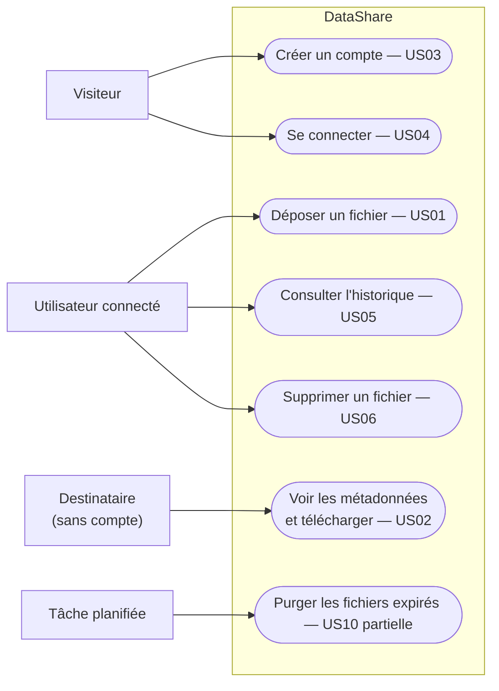

# User Stories — DataShare

Reprises de `../brief/specifications.pdf`. Les écrans cités sont les maquettes,
conservées hors dépôt pour l'instant. La numérotation `USxx` est celle du brief :
**l'utiliser partout** — commits, tests, documentation, soutenance.

## Qui fait quoi

Un visiteur devient utilisateur connecté après US04. Le destinataire n'a besoin que
du lien.

---

## MVP — obligatoire

### US01 — Upload (avec compte)

Un utilisateur connecté dépose un fichier et obtient un lien de téléchargement unique.

- fichier stocké en local ou cloud · token unique généré pour le lien
- expiration **7 jours par défaut, configurable à l'envoi** (max 7 jours)
- **mot de passe optionnel** (min. 6 caractères)
- fichier expiré **refusé au téléchargement**, listé « expiré » dans l'historique ;
  fichier physique effacé par la purge quotidienne (US10 partielle)
- fichier lié à l'utilisateur, retrouvable dans son historique
- taille max **1 Go** · extensions interdites à définir (`.exe`, `.bat`…)

**Droits** : authentifiés uniquement
**Écrans** : `televersement/02-ajouter-fichier-*`, `03-lien-genere-*`

### US02 — Téléchargement via lien

Un destinataire télécharge un fichier via son lien unique.

- identifiant **non prédictible**
- mot de passe requis si défini · **validé côté client ET serveur**
- lien expiré ou invalide → **erreur explicite**
- métadonnées (nom, type, taille, expiration) **visibles avant** téléchargement

**Droits** : toute personne disposant du lien valide
**Écrans** : `telechargement/*` (4 états)

### US03 — Création de compte

- email **unique**, format valide · mot de passe **min. 8 caractères**, haché et salé
- **pas de rôle** dans le MVP · pas d'email de confirmation
- JWT créé à la connexion

**Écrans** : `login/03-creation-compte-*`

### US04 — Connexion utilisateur

- email + mot de passe · **JWT** généré et transmis au client

**Écrans** : `login/02-connexion-*`

### US05 — Consultation de l'historique

- affiche nom, taille, date d'envoi, date d'expiration, état (valide / expiré)
- **ni tri ni filtrage obligatoires** dans le MVP
- suppression manuelle possible avant expiration

**Droits** : le propriétaire uniquement
**Écrans** : `mon-espace/02-mes-fichiers-*`

### US06 — Suppression d'un fichier

- supprime **physiquement** le fichier et toutes ses métadonnées · **irréversible**
- **confirmation requise côté front**
- par défaut, l'historique n'affiche que les fichiers non expirés

**Droits** : ses propres fichiers uniquement

---

